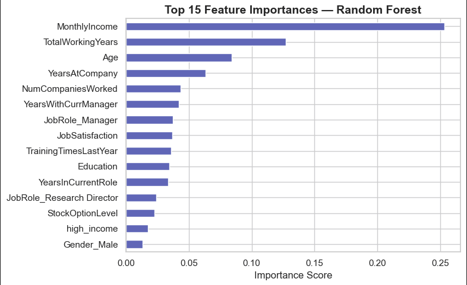
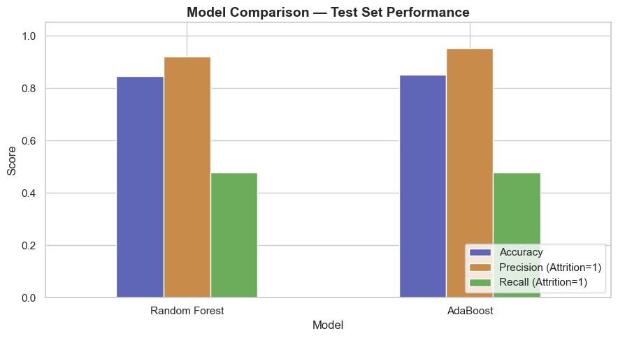
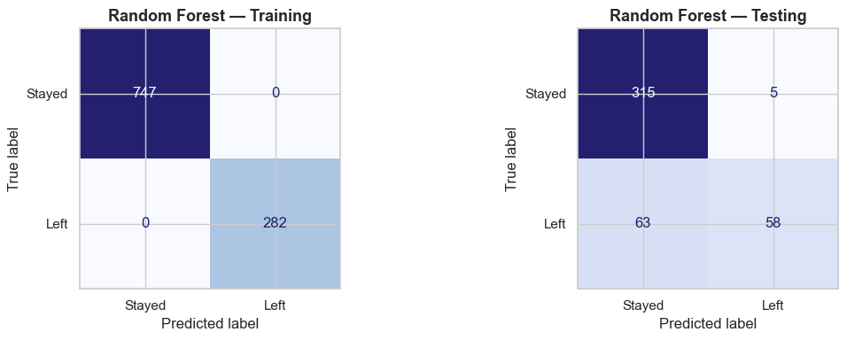
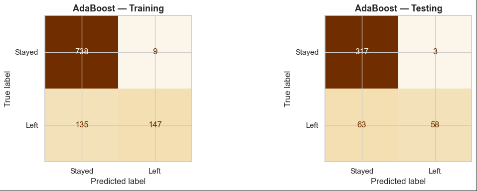
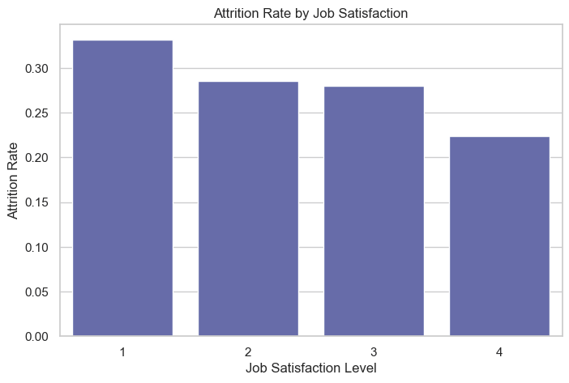
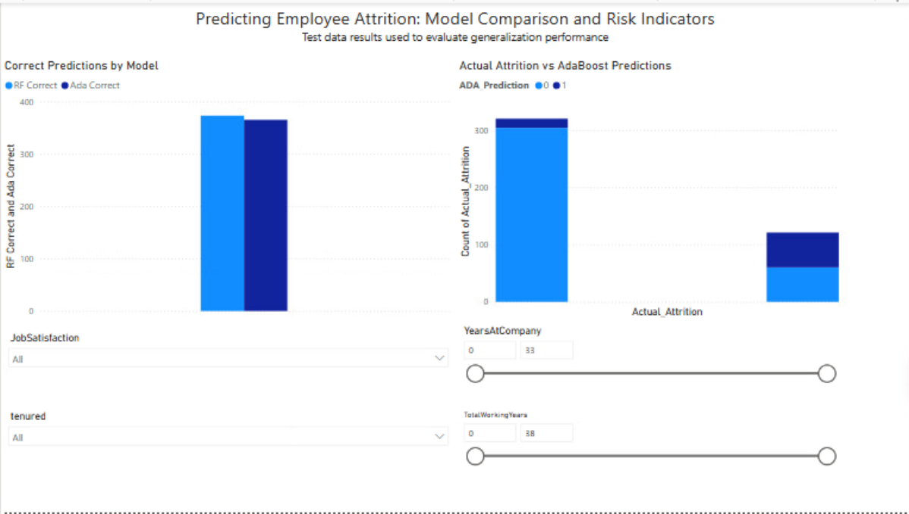

# 👥 Predicting Employee Attrition
**Academic Project — DAT 430 | Southern New Hampshire University (2025)**

> *When people leave, organizations lose more than headcount. This project asks: can we see it coming?*

---

## The Problem

A structured HR dataset representing a financial institution becomes the foundation for a real question: which employees are most at risk of leaving, and why? Reactive hiring is expensive. The goal was to build a predictive model that could flag at-risk employees early enough to actually do something about it.

The challenge wasn't just building a classifier — it was catching the *right* failures. Missing an at-risk employee costs more than a false alarm. Every modeling decision flows from that.


---

## What I Did

This project builds a two-stage ML pipeline — escalating from a baseline model to tuned ensemble methods — with results visualized in an interactive Power BI dashboard.

**Tools used:** Python (pandas, scikit-learn, seaborn, matplotlib), Power BI, Jupyter Notebook  
**Data scope:** IBM HR Analytics dataset, 1,470 employee records across 35 features

---

### Stage 1 — Baseline Logistic Regression

Starting simple on purpose. Before throwing ensemble models at a problem, it's worth knowing exactly what a basic model can and can't do.

- Engineered a `high_income` binary feature from monthly salary data
- Built a logistic regression classifier using income and manager tenure as predictors
- Evaluated accuracy, precision, and recall on both the full dataset and a high-income subgroup

**Result:** ~70% overall accuracy but weak recall — the model missed too many actual attrition cases. Income and tenure alone aren't enough. More features needed.

📓 [`baseline_logistic_regression.ipynb`](baseline_logistic_regression.ipynb)

---

### Stage 2 — Random Forest vs. AdaBoost

Armed with the baseline's limitations, Stage 2 expands the feature set and escalates to ensemble methods.

- Added engineered features: `high_income`, `tenured` (years at company ≥ 11)
- One-hot encoded categorical variables: Gender, JobRole, Department, MaritalStatus
- Tuned both models using **GridSearchCV** with 5-fold cross-validation, optimizing for **recall** — because missing an at-risk employee is costlier than a false alarm
- Compared Random Forest vs. AdaBoost performance side by side

**Result:** Both models achieved ~85% test accuracy. Random Forest edged out AdaBoost on correct predictions overall, while AdaBoost showed marginally higher precision on the attrition class.

📓 [`employee_attrition_analysis.ipynb`](employee_attrition_analysis.ipynb)

---

### Feature Importance

Random Forest's top predictors surface a clear story: compensation and career trajectory dominate attrition risk. Job satisfaction appears, but ranks well below income and tenure variables..



The top drivers:
- **MonthlyIncome** (~0.25 importance score) — the single strongest predictor by a wide margin
- **TotalWorkingYears** and **Age** — career stage matters as much as pay
- **YearsAtCompany** — early-tenure employees are disproportionately at risk
- **JobSatisfaction** — present, but not dominant. Satisfaction alone doesn't explain who leaves.

---

### Why Recall Over Accuracy?

Worth calling out explicitly. In attrition prediction, a false negative — predicting someone stays when they're about to leave — is far more costly than a false positive. GridSearchCV was configured with `scoring='recall'` for exactly this reason.

Both models achieved ~48% recall on the attrition class. That's not a failure — it's an honest reflection of class imbalance. Attrition is rare (~16% of the dataset), which makes recall-focused tuning essential and inflated accuracy a trap.



---

### Confusion Matrices

The training vs. testing split tells the real story about generalization.

**Random Forest** trained to near-perfection (747/747 stayed, 282/282 left) — a textbook overfitting flag. On test data it holds up reasonably but still struggles with minority class recall.



**AdaBoost** showed more honest training performance, trading some training accuracy for slightly better generalization behavior.



---

### Attrition by Job Satisfaction

Employees with the lowest job satisfaction (Level 1) leave at the highest rate (~33%). The trend is consistent — higher satisfaction correlates with lower attrition across all levels.



Notably, satisfaction's importance score in the Random Forest model is modest relative to income and tenure. This suggests satisfaction is a contributing signal, not a root cause — compensation and career stage dominate attrition risk..

---

### Power BI Dashboard

Model outputs were exported to CSV and visualized in an interactive Power BI dashboard featuring:

- **Correct Predictions by Model** — RF vs. AdaBoost side-by-side
- **Actual Attrition vs. AdaBoost Predictions** — breakdown by actual outcome
- **Interactive filters** — slice by JobSatisfaction, tenure status, YearsAtCompany, and TotalWorkingYears



🖼️ Screenshots only — Power BI file not included in repo.

---

## What I Found

- **Compensation is the dominant attrition driver** — MonthlyIncome accounts for ~25% of Random Forest's feature importance, nearly double the next predictor
- **Career stage matters more than satisfaction** — TotalWorkingYears, Age, and YearsAtCompany collectively outweigh JobSatisfaction as predictors
- **Early-tenure employees are the highest-risk group** — employees newer to the company are disproportionately represented in attrition cases
- **Both models struggle with minority class recall (~48%)** — a direct consequence of class imbalance, not model failure; tuning for recall is the right call
- **Random Forest overfits on training data** — perfect training scores (747/747, 282/282) don't transfer cleanly to test; AdaBoost generalizes more honestly
- **Job satisfaction is a signal, not a solution** — present in the top 15 features but not a standalone lever; organizations cannot rely on satisfaction initiatives alone to address compensation-driven attrition

---

## The Recommendation

Retention interventions should prioritize **compensation benchmarking and early-tenure support programs** as the highest-impact levers. Satisfaction surveys and engagement initiatives are supporting tools, not substitutes for addressing structural pay and career development gaps.

With a tuned recall-optimized pipeline and an interactive dashboard, HR teams can identify at-risk segments early and evaluate intervention effectiveness over time — rather than reacting after employees have already decided to leave.

---

## Repo Structure

```
employee-attrition-analysis/
├── README.md
├── baseline_logistic_regression.ipynb
├── employee_attrition_analysis.ipynb
├── predictions_train.csv
├── predictions_test.csv
├── HRData1.csv
├── HRData2.csv
└── assets/
    ├── Full_visual_dashboard_with_title.png
    ├── confusion_matrix_Random_Forest.png
    ├── confusion_matrix_AdaBoost.png
    ├── Feature_Importance.png
    ├── Model_comparison_RF_AdaBoost.png
    ├── attrition_by_job_satisfaction.png
    ├── dashboard_visuals_1_2.png
    ├── visual_model_accuracy.png
    ├── visual_attrition_breakdown.png
    └── visual_filters.png
```

---

## About Me

I'm Kat — data analyst, creative coder, chaos gremlin. I like finding the signal in messy systems and building tools that make the answer obvious.

📎 [Portfolio](https://glitchwitchkitty.github.io/chaosgremlinhq-portfolio/)  
📎 [GitHub](https://github.com/glitchwitchkitty)
